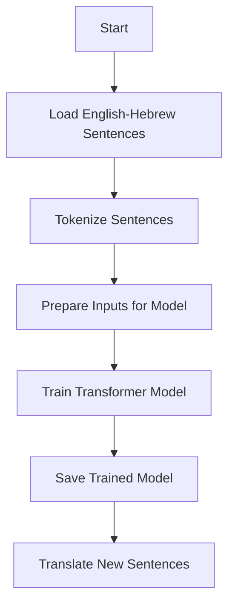

# 🌍 English ↔ Hebrew Transformer (PyTorch)

A transformer-based deep learning model that **translates English sentences into Hebrew** using the `opus100` bilingual dataset. The notebook builds everything from data preparation to training and inference.

---

## 📦 What This Project Does

* Loads bilingual English-Hebrew data.
* Uses tokenizer files to convert text into numbers.
* Feeds data into a transformer model.
* Trains the model to learn translation.
* Uses the trained model to translate new English sentences into Hebrew.

---

## 🧠 How It Works (Simple Flow)

---

## 🔍 What You Need

* **Tokenizers** for English and Hebrew (pre-built).
* The **opus100** dataset from HuggingFace.
* A GPU is helpful for training but not necessary for inference.

---

## 💡 Key Concepts (Explained Simply)

### 1. Tokenization

Breaking text into units (tokens) and assigning each one a number. This makes it readable for the model.

### 2. Encoder & Decoder

* **Encoder** reads the English sentence.
* **Decoder** learns to produce the Hebrew sentence, one word at a time.

### 3. Masks

Help the model:

* Ignore padding.
* Prevent the decoder from "cheating" by seeing future words.

---

## 🔄 A Simple Example

**English:**
`"How are you?"`

**Model translates it to Hebrew:**
`"מה שלומך?"`

**Another Example:**

| English             | Hebrew         |
| ------------------- | -------------- |
| Good morning        | בוקר טוב       |
| I love learning     | אני אוהב ללמוד |
| Where is the hotel? | איפה המלון?    |

---

## ✅ What Happens Internally

1. Each sentence is wrapped with `[START]` and `[END]` tokens.
2. Padded to make all inputs the same length.
3. The model learns from many such examples.
4. Translations improve after every training cycle (epoch).
5. Saved checkpoints let you re-use the trained model.

---

## 🎯 Final Outcome

You’ll have:

* A trained model that can translate English into Hebrew.
* The ability to reuse the model to translate any English sentence you input.

---

## 👤 Author

For any questions or issues, please open an issue on GitHub: [@Siddharth Mishra](https://github.com/Sid3503)

---

  Made with ❤️ and lots of ☕

